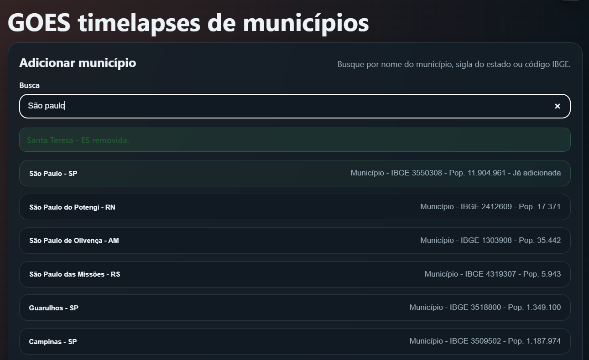
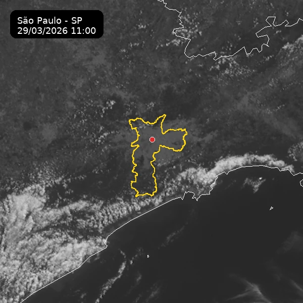
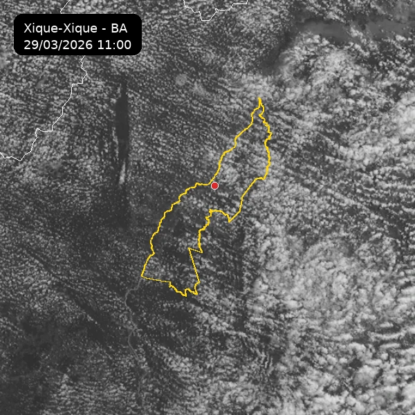

# GOES Timelapse para Home Assistant

Este repositório contém um app do Home Assistant para acompanhar municípios brasileiros com imagens do satélite GOES-19. O app baixa os quadros brutos oficiais da NOAA na Banda 2 visível, mantém um cache local durante a janela solar e gera animações WebP dentro do Home Assistant.

## O que o app faz

- Busca municípios brasileiros.
- Mantém até 5 municípios acompanhados ao mesmo tempo.
- Atualiza automaticamente os quadros brutos do GOES-19 durante a janela solar.
- Regera as animações quando chegam novos quadros.
- Publica os arquivos finais em `/media/goes_timelapse/`.

## Requisitos

- Home Assistant com Supervisor.
- Arquitetura `amd64`.

## Uso de rede

Este app usa os produtos oficiais `ABI-L1b-RadF-M6C02` da NOAA, em formato `netCDF`, e converte cada quadro para um `GeoTIFF` local do Brasil antes de renderizar as animações.

- O download bruto acontece só na janela solar configurada. Com o padrão atual, isso significa aproximadamente `1 hora antes do nascer do sol` até `1 hora depois do pôr do sol`.
- Cada raw oficial costuma ter algo em torno de `390 MB` a `425 MB`.
- Como o produto full disk é atualizado em intervalos de `10 minutos`, a estimativa prática fica na faixa de `28 a 34 GB por dia` quando há municípios acompanhados.
- Em instalações novas, reinícios ou recuperação de indisponibilidade, pode haver um pico temporário enquanto o cache bruto é recomposto.
- Em disco, o app não guarda todos os `netCDF` baixados. Depois da conversão, ele mantém apenas o cache local dos `GeoTIFFs` recentes, o que reduz bastante o uso de armazenamento em relação ao bruto original.

## Como adicionar ao Home Assistant

1. No Home Assistant, abra `Configurações` > `Apps`.
2. Abra a loja de apps.
3. No menu de repositórios, adicione esta URL:

   ```text
   https://github.com/chiconws/br-goes-timelapse
   ```

4. Atualize a loja.
5. Procure por `GOES Timelapse`.
6. Clique em `Instalar`.
7. Inicie o app e abra a interface pela opção de Ingress.

Em versões mais antigas do Home Assistant, a área de `Apps` ainda pode aparecer como `Add-ons`.

## Como usar

1. Abra a interface do app.
2. Busque o município desejado.
3. Adicione o município ao acompanhamento.
4. Aguarde o primeiro download dos quadros brutos da NOAA e a conversão inicial do cache.
5. Quando o processamento terminar, a animação ficará disponível na interface e em `/media/goes_timelapse/`.

## Capturas de tela

Busca de municípios:



Prévia de animação gerada:





## Estrutura do repositório

- `repository.yaml`: metadados do repositório para o Home Assistant.
- `goes_timelapse/`: pasta do app do Home Assistant.
